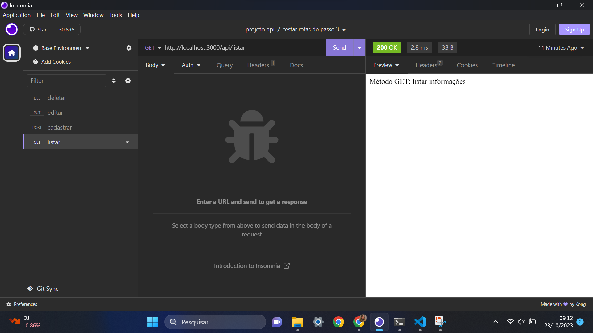
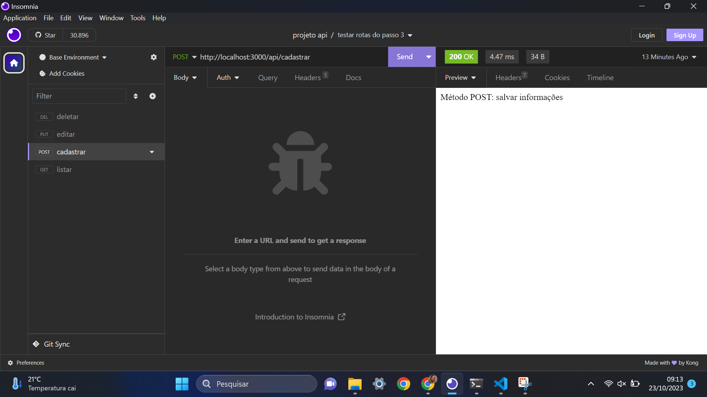
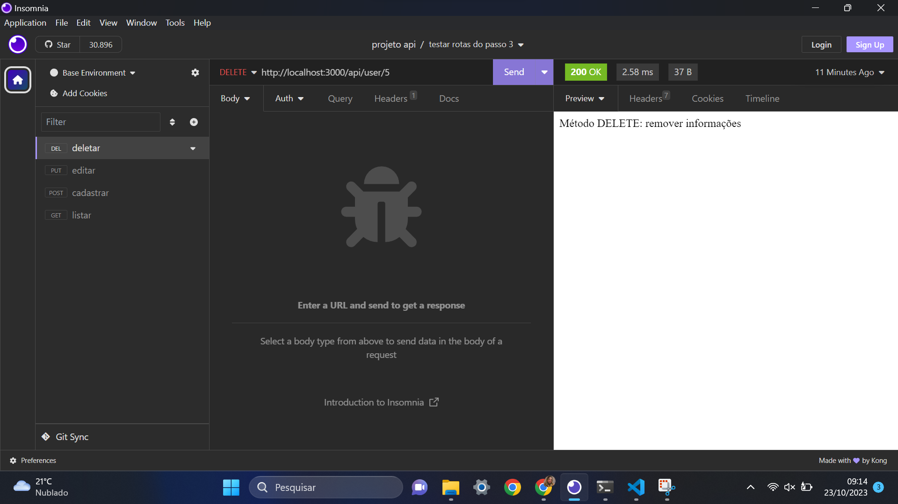
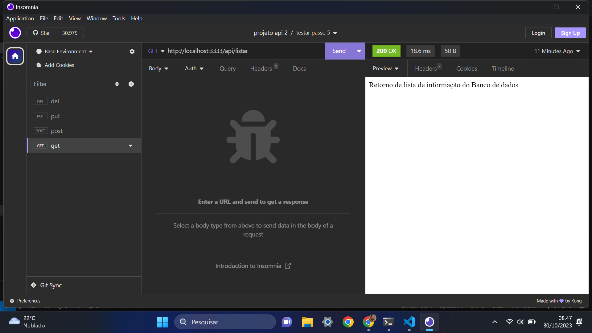
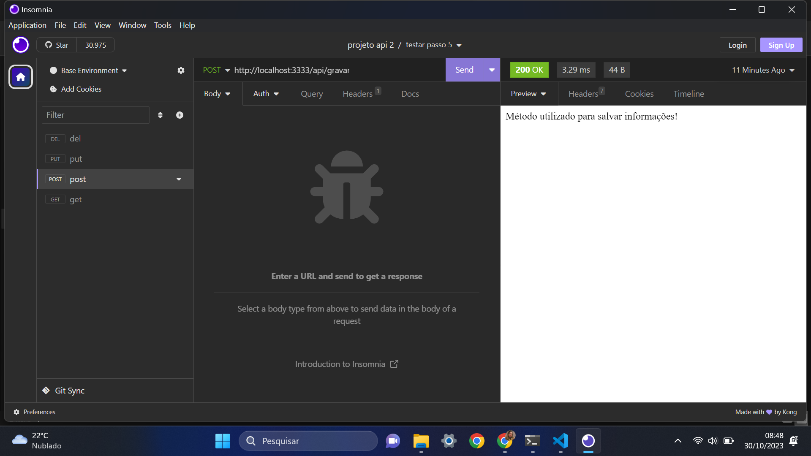
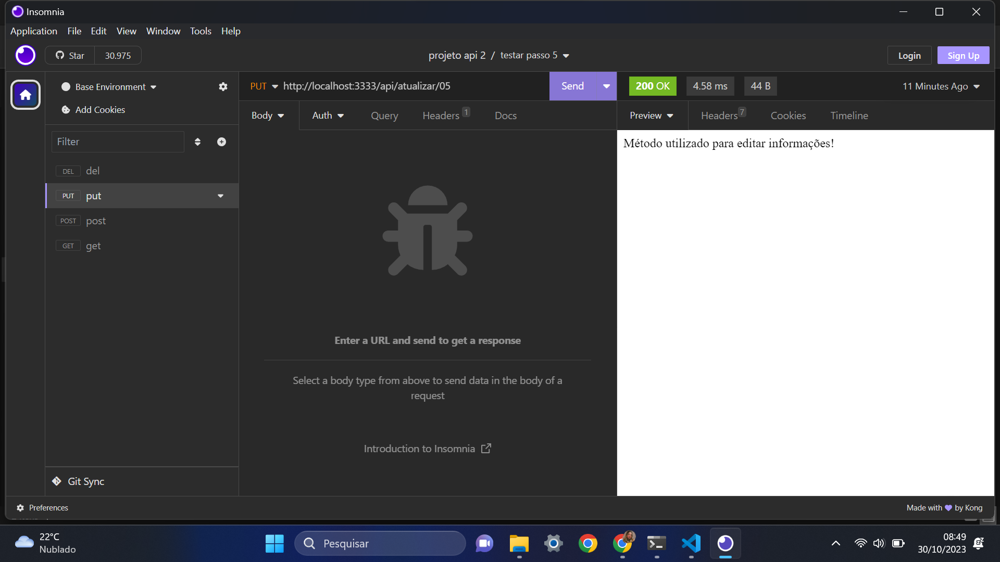

PASSO 1:


Criar pasta para a aplicação
```
mkdir projetoBackend
```

Acessar pasta
```
cd projetoBackend
```

Criar arquivo para documentar projeto
```
touch readme.md
```

Iniciar o gerenciador de pacotes Node
```
npm init -y
```

Instalar os pacotes
```
npm i express nodemon dotenv
```

Abrir o VSCode
```
code .
```

Criar arquivo .gitignore
```
nano .gitignore
```

Adicionar no arquivo .gitignore o nome da pasta criada após a instalação dos pacotes
```
node_modules
```

Criar estrutura de arquivos e pastas
```
mkdir src
```

Criar arquivos dentro da pasta src
```
touch src/app.js
```

```
touch src/server.js
```

Criar pastas dentro da pasta src
```
mkdir src/config
```

```
mkdir src/controllers
```

```
mkdir src/routes
```

Enviar estrutura do projeto para o gitHub
```
git init
```

```
git config --global user.name "FIRST_NAME"
```

```
git config --global user.email "EMAIL@EXAMPLE.COM"
```

```
git status
```

```
git add .
```

```
git commit -m 'estrutura do projeto'
```

```
git branch -M main
```

```
git remote add origin COLAR_URL
```

```
git push -u origin main
```


PASSO 2:


Clonar o repositório na sua máquina
```
git clone URL_REPOSITORIO
```

Acessar pasta
```
cd NOME_REPOSITORIO
```

Reinstalar os pacotes da aplicação
```
npm i
```

Criar arquivo .env na raiz do projeto
```
nano .env
```

```
PORT = 3008
```

Adicionar arquivo .env no .gitignore
```
nano .gitignore
```

```
.env
```

Abrir o VSCode
```
code .
```

Criar arquivo de exemplo para para as variáveis necessárias da aplicação
```
nano .env.example
```

```
PORT = 
```

Abrir o arquivo app.js e digitar o código
```
const express = require('express');
```

```
const dotenv = require('dotenv').config();
```

```
const app = express();
```

```
app.set('port', process.env.PORT || 3333);
```

```
module.exports = app;
```

Abrir o arquivo server.js e digitar os códigos
```
const app = require('./app');
```

```
const port = app.get('port');
```

```
app.listen(port, () => {
    console.log(`Running on port ${ port }!`);
});
```

Abrir o arquivo package.json e alterar a chave 'scripts'
```
"start":"nodemon src/server.js"
```

```
"start":"nodemon src/server.js"
```

Rodar o comando no termial com gitBash
```
npm run start
```

Atualizar projeto no gitHub
```
git add .
```

```
git commit -m 'configuração do projeto'
```

```
git push
```


PASSO 3: 


Clonar o repositório na sua máquina
```
git clone URL_REPOSITORIO
```

Acessar a pasta 
```
cd NOME_REPOSITORIO
```

Reinstalar os pacotes da aplicação
```
npm i
```

Criar pastas dentro da pasta src
```
mkdir src/routes
```

Criar arquivo dentro da pasta routes
```
touch src/routes/rotas.js
```

Abrir o VSCode
```
code .
```

Abrir o arquivo rotas.js e digitar os códigos
```
// Importar o modulo de Router do express
const { Router } = require('express');

// Instanciar o Router na variável router
const router = Router();

router.get('/listar', (request, response) => {
    response.send('Método GET: listar informações');
});
router.post('/cadastrar', (request, response) => {
    response.send('Método POST: salvar informações');
});
router.put('/user/:id', (request, response) => {
    response.send('Método PUT: atualizar informações');
});
router.delete('/user/:id', (request, response) => {
    response.send('Método DELETE: remover informações');
});

module.exports = router;
```

Abrir o arquivo app.js e adicionar o código
```
const router = require('./routes/rotas');
```

```
app.use('/api', router);
```

Atualizar projeto no gitHub
```
git add .
```

```
git commit -m 'rotas do projeto'
```

```
git push
```


PASSO 4:

Clonar o repositório na sua máquina
```
git clone URL_REPOSITORIO
```

Acessar pasta
```
cd NOME_REPOSITORIO
```

Reinstalar os pacotes da aplicação
```
npm i
```

Recriar arquivo .env

Definir as variáveis no arquivo .env a partir das chaves definidas no arquivo .env.example


INSOMNIA

Passo get:


Passo post:


Passo put: 


Passo delete:



PASSO 5:

Clonar o repositório na sua máquina
```
git clone URL_REPOSITORIO
```

Acessar a pasta 
```
cd NOME_REPOSITORIO
```

Reinstalar os pacotes da aplicação
```
npm i
```

Recriar arquivo .env
```
PORT = 3000
```

Criar pasta 'controllers' dentro da pasta 'src'

Criar arquivo 'crudController.js' na pasta 'controllers'

Colar os códigos no arquivo crudController.js
```
function listarDados(request, response) {
    response.send('Retorno de lista de informação do Banco de dados');
}

function gravarDados(request, response) {
    response.send('Método utilizado para salvar informações!');
}

function atualizarDados(request, response) {
    response.send('Método utilizado para editar informações!');
}

function deletarDados(request, response) {
    response.send('Método utilizado para deletar informações!');
}

module.exports = {
    listarDados,
    gravarDados, 
    atualizarDados, 
    deletarDados
}
```

Alterar o arquivo 'rotas.js'
```
// Importar pacote do express
const { Router } = require('express');
// Instanciar o Router na variavel router
const router = Router();
// Importar funções do controller para a rota acessar as funções
const { 
    listarDados,
    gravarDados,
    atualizarDados,
    deletarDados
 } = require('../controllers/crudController');

router.get('/listar', listarDados);

router.post('/gravar', gravarDados);

router.put('/atualizar/:id', atualizarDados);

router.delete('/deletar/:id', deletarDados);

module.exports = router;
```

Rodar o comando 
```
npm start
```

Abrir o insomnia

Testar as 4 requisições para os métodos GET, POST, PUT e DELETE e validar os conteúdos de cada rota retornados pelas funções do 'crudController'


INSOMNIA

Passo get:


Passo post:


Passo put: 


Passo delete:
